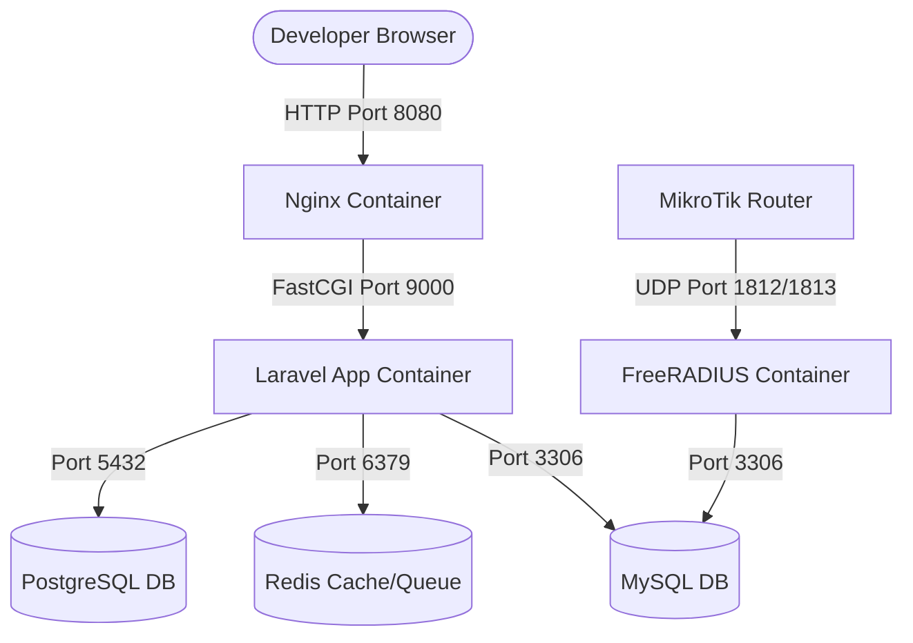

# ISP Billing SaaS - Docker Development Environment

This repository provides a complete, containerized local development environment for the SaaS ISP Billing System. It is designed to simulate a production-grade multi-service architecture using Docker Compose.

---

## Technical Stack & Architecture

- **Backend**: Laravel 11 running on PHP 8.2 FPM
- **Frontend**: React + Inertia.js + Vite + FilamentPHP
- **Primary Database**: PostgreSQL 15 (Main Application & Tenancy Data)
- **Radius Database**: MySQL 8.0 (Dedicated solely to FreeRADIUS)
- **Cache & Queue**: Redis (Alpine)
- **Web Server**: Nginx (Alpine) with security headers & caching policies
- **Network Integration**: FreeRADIUS & MikroTik API integration readiness

---

## Prerequisites

Ensure you have the following installed on your machine:
1. **Docker Desktop** (or Docker Engine with Docker Compose)
2. **Git**

---

## Step-by-Step Setup Guide

### 1. Configure the Environment
Copy the example environment file and configure the port and connection details:
```bash
cp .env.example .env
```
Ensure that the database host addresses in `.env` match their respective Docker service names (`postgres`, `mysql`, `redis`).

### 2. Build the Containers
Build the custom application image (installs PHP extensions, Node.js 20, npm, and Composer):
```bash
docker compose build
```

### 3. Start the Containers
Start all services in background mode (detached):
```bash
docker compose up -d
```
Docker Compose will verify service health in order of dependency:
- `postgres`, `mysql`, and `redis` start first and run their health checks.
- Once healthy, the `app` container starts.
- Once the `app` starts, the `nginx` container opens port `80` mapping to your host's `APP_PORT` (default `8080`).
- The `freeradius` container starts after `mysql` is healthy.

Check status with:
```bash
docker compose ps
```

### 4. Install PHP Dependencies (Composer)
Run Composer install inside the application container:
```bash
docker compose exec app composer install
```

### 5. Install Frontend Dependencies (NPM)
Install frontend packages and start the Vite development server:
```bash
docker compose exec app npm install
```
To run the Vite dev server for React hot-module replacement (HMR):
```bash
docker compose exec -d app npm run dev
```

### 6. Generate Laravel Application Key
Initialize the Laravel cryptograhic key:
```bash
docker compose exec app php artisan key:generate
```

### 7. Run Database Migrations
Run migrations on the PostgreSQL primary database:
```bash
docker compose exec app php artisan migrate --seed
```

### 8. Set Up Filament Admin Panel
Create your admin user for FilamentPHP:
```bash
docker compose exec app php artisan make:filament-user
```
Follow the interactive prompts to set the email, name, and password.

---

## Accessing Services & Ports

Here is how you can interface with each container:

| Service | Host Port | Internal Port | Protocol | Credentials / Details |
| :--- | :--- | :--- | :--- | :--- |
| **Nginx (Web Application)** | `8080` (or `APP_PORT`) | `80` | HTTP | Frontend and Backend routes. |
| **PostgreSQL** | `5432` | `5432` | TCP | DB: `isp_billing`, User: `postgres`, Pass: `postgres` |
| **MySQL (FreeRADIUS)** | `3306` | `3306` | TCP | DB: `radius`, User: `radius`, Pass: `radius123`, Root Pass: `root` |
| **Redis** | `6379` | `6379` | TCP | Session, cache, queue driver. No password. |
| **FreeRADIUS Authentication** | `1812` | `1812` | UDP | RADIUS Auth Port |
| **FreeRADIUS Accounting** | `1813` | `1813` | UDP | RADIUS Acct Port |

### Accessing Databases and Services on the Host:
- **PostgreSQL**: Connect your desktop client (e.g. DBeaver, TablePlus, pgAdmin) to `localhost:5432` with user `postgres` and password `postgres`.
- **MySQL**: Connect your client to `localhost:3306` with user `radius` and password `radius123` (or `root` with password `root`).
- **Redis**: Connect using `redis-cli -p 6379` or any GUI tool to `localhost:6379`.
- **FreeRADIUS testing**: Test authentication from your host terminal using standard radclient (if installed):
  ```bash
  echo "User-Name = 'testuser', User-Password = 'testpassword'" | radclient -x localhost:1812 auth testing123
  ```

---

## FreeRADIUS SQL Configuration & Database Schema

FreeRADIUS configuration is persistent. The main configuration directory inside the container is located at `/etc/raddb` and is mapped to the Docker volume `radius_config`.

### 1. Importing the FreeRADIUS Database Schema
Before enabling SQL authentication, the MySQL `radius` database must be populated with FreeRADIUS schema structures.
Generate and import the schema directly using the files bundled in the container:
```bash
docker compose exec freeradius cat /etc/raddb/mods-config/sql/main/mysql/schema.sql | docker compose exec -T mysql mysql -u radius -pradius123 radius
```

You should also import the default setup data (NAS table, groups, etc.) if required:
```bash
docker compose exec freeradius cat /etc/raddb/mods-config/sql/main/mysql/setup.sql | docker compose exec -T mysql mysql -u root -proot radius
```

### 2. Custom SQL Configuration Mount Location
To enable FreeRADIUS to query MySQL:
1. The SQL module config file inside FreeRADIUS is located at:
   `/etc/raddb/mods-available/sql`
2. Update this file to configure database connectivity parameters:
   - `driver = "rlm_sql_mysql"`
   - `server = "mysql"` (uses the Docker Compose network hostname)
   - `port = 3306`
   - `login = "radius"`
   - `password = "radius123"`
   - `radius_db = "radius"`
3. Enable the SQL module by symbolic link:
   ```bash
   docker compose exec freeradius ln -sf /etc/raddb/mods-available/sql /etc/raddb/mods-enabled/sql
   ```
4. Restart the FreeRADIUS service:
   ```bash
   docker compose restart freeradius
   ```

---

## Architecture & Service Communication

To understand how services talk to one another, refer to the details below:



### Communication Flow Explanation:
1. **Developer Request Flow**:
   - You request the application from your browser via `http://localhost:8080`.
   - The **Nginx** container receives the request, hosts the React/Vite assets, and proxies standard PHP requests to the **App** container (`isp_app`) using FastCGI on port `9000`.
2. **Laravel Processing**:
   - The **App** container runs Laravel. It communicates inside the private network (`isp-network`) with **PostgreSQL** (`isp_postgres`) to serve application data, multi-tenancy parameters, and admin records.
   - It stores cached sessions, system jobs, and queue sequences in **Redis** (`isp_redis`).
3. **Billing Syncing & Provisioning**:
   - When administrators create or update internet packages, users, or active billing status inside the Laravel Admin panel (FilamentPHP), the application connects to the **MySQL** database (`isp_mysql_radius`) to update client records, quotas, and passwords in the FreeRADIUS tables.
4. **Network Access Control**:
   - When a MikroTik PPPoE server or Hotspot router queries the system for subscriber authentication, it forwards UDP packets on ports `1812` (Authentication) and `1813` (Accounting) to the **FreeRADIUS** container (`isp_freeradius`).
   - FreeRADIUS queries the **MySQL** database directly (`isp_mysql_radius` on port `3306`) to check user credentials and active status. It returns access accept/reject packages directly back to the router.
